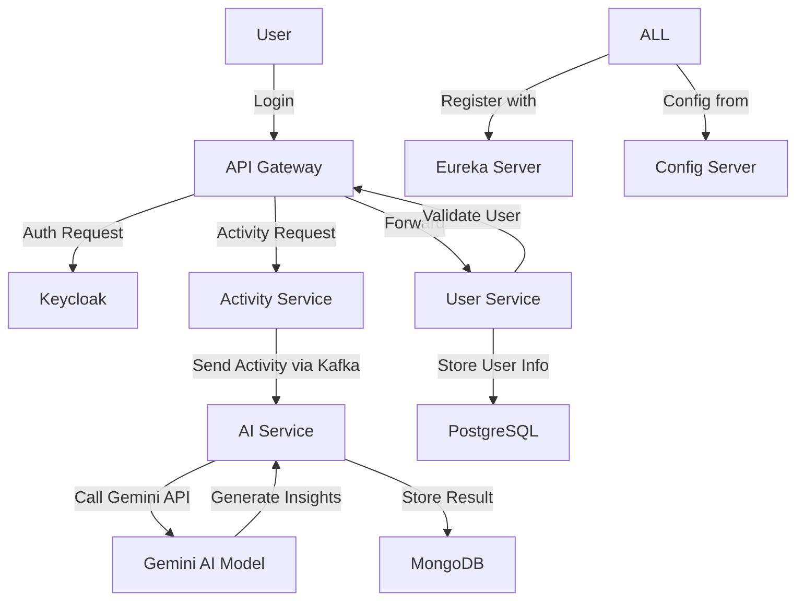

# 🏋️‍♂️ Fitness Microservice Ecosystem

This repository contains a complete **microservices-based fitness tracking platform**, designed with scalability, modularity, and AI integration in mind.  
The system uses **Spring Boot, Eureka, Keycloak, Kafka, Gemini API, PostgreSQL, MongoDB**, and **Spring Cloud Gateway**.

---

## 🚀 Overview

The platform enables users to log fitness activities, receive AI-generated insights and recommendations, and manage authentication and configurations seamlessly across services.

### 🧩 Microservices Architecture
| Service Name      | Description |
|--------------------|-------------|
| **Service Registry (Eureka Server)** | Centralized service discovery component where all microservices register themselves. Helps in tracking and locating active services dynamically. |
| **Config Server** | Stores and serves configuration (`.yaml`) files for all services. Enables centralized and environment-specific configuration management. |
| **API Gateway** | Acts as the single entry point for all clients. Routes incoming requests to appropriate services and integrates with **Keycloak** for authentication. |
| **User Service** | Handles all user-related operations such as registration, validation, and profile management. Integrated with **Keycloak** for secure authentication. Uses **PostgreSQL** as the database. |
| **Activity Service** | Manages user activity data (type, duration, calories, etc.). Validates the user via User Service, then sends basic activity details to **AI Service** asynchronously via **Kafka**. |
| **AI Service** | Processes activity data using **Gemini API**. It formats and analyzes the data to generate AI-driven insights, improvements, and safety guidelines. Results are stored in **MongoDB**. |

---

## 🧠 System Flow



⚙️ Tech Stack

| Category                        | Technologies                                    |
| ------------------------------- | ----------------------------------------------- |
| **Backend Framework**           | Spring Boot 3.4.6                               |
| **Service Discovery**           | Spring Cloud Eureka Server                      |
| **API Gateway**                 | Spring Cloud Gateway                            |
| **Security**                    | Keycloak (OAuth2 + OpenID Connect)              |
| **Messaging Queue**             | Apache Kafka                                    |
| **Databases**                   | PostgreSQL (User Service), MongoDB (AI Service) |
| **Configuration Management**    | Spring Cloud Config Server                      |
| **AI Integration**              | Gemini API                                      |
| **Build Tool**                  | Maven                                           |
| **Containerization (Optional)** | Docker                                          |


## 🧩 Service Responsibilities

### 1. 🧭 Service Registry (`ServiceRegistry`)

* Built using **Spring Cloud Netflix Eureka**
* All services register here for **centralized tracking and discovery**

---

### 2. ⚙️ Config Server (`ConfigServer`)

* Centralized configuration management for all services
* Supports multiple environments (**dev**, **prod**, etc.)
* Each service fetches configuration dynamically on startup

---

### 3. 🔐 User Service (`UserService`)

* Manages **user registration, validation, and profile management**
* Integrated with **Keycloak** for authentication and token validation
* Data stored in **PostgreSQL**

**Key Endpoints**

```
POST   /users/register
GET    /users/validate
GET    /users/{id}
```

---

### 4. 🏃 Activity Service (`ActivityService`)

* Handles **fitness activity records**
* Validates users via the **User Service** before saving activities
* Publishes data to **Kafka** for asynchronous AI analysis

**Key Endpoints**

```
POST   /activities/create
GET    /activities/{userId}
GET    /activities/detail/{activityId}
```

---

### 5. 🤖 AI Service (`AiService`)

* Listens to Kafka topics for new activities
* Uses **Gemini API** to generate intelligent insights and recommendations
* Persists AI-generated analysis (recommendations, improvements, safety tips) in **MongoDB**

**Key Endpoints**

```
POST   /ai/process
GET    /ai/activities/{id}
```

---

### 6. 🌉 API Gateway (`ApiGateway`)

* Routes incoming requests to the correct microservice
* Integrates with **Keycloak** for authentication & authorization
* Acts as a **load balancer** for scalability

**Routing Examples**

```
/users/**      → User Service  
/activities/** → Activity Service  
/ai/**         → AI Service
```

---

## 🔒 Security

* Authentication & authorization handled by **Keycloak**
* Tokens validated at **API Gateway** level
* Internal service-to-service communication secured with **Bearer tokens**

---

## 🧰 Tools & Utilities

| Tool                            | Purpose                      |
| ------------------------------- | ---------------------------- |
| 🧪 **Postman**                  | API Testing                  |
| 🧩 **Kafka UI / Console**       | Topic Monitoring             |
| 🗃️ **PgAdmin / Mongo Compass** | Database Management          |
| 🌍 **Eureka Dashboard**         | Service Discovery & Tracking |

---

> 💡 This modular design ensures scalability, resilience, and clean separation of concerns across all microservices.

